# Лабораторна робота 1. Робота з СУБД PostgreSQL та основи SQL

## Загальна інформація

**Здобувач освіти:** Федорчук Богдан Павлович
**Група:** ІПЗ-31
**Обраний рівень складності:** 1

## Виконання завдань

### Список таблиць

```sql
-- Запит для отримання списку таблиць
SELECT table_name
FROM information_schema.tables
WHERE table_schema = 'public'
ORDER BY table_name;
```

Результат: У базі даних створено 8 основних таблиць: categories, customers, employees, order_items, orders, products, regions, suppliers.

Скріншот
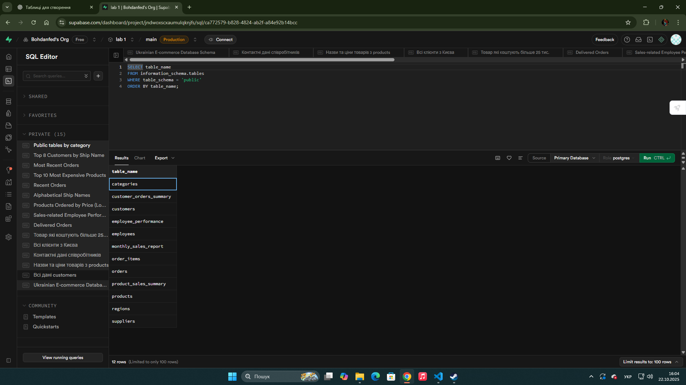


### Отримати всі записи з таблиці customers.

```sql
SELECT * FROM customers;
```

Результат: Отримано 15 записів клієнтів, включаючи як фізичних осіб, так і юридичні особи з різних міст України.

Скріншот
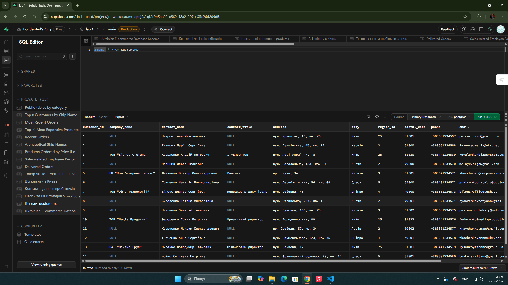
### Вивести тільки назви товарів і їхні ціни з таблиці products.
```sql
select product_name, unit_price
from products;
```
Результат: Отримано 25 назви продукта та їх ціни.

Скріншот
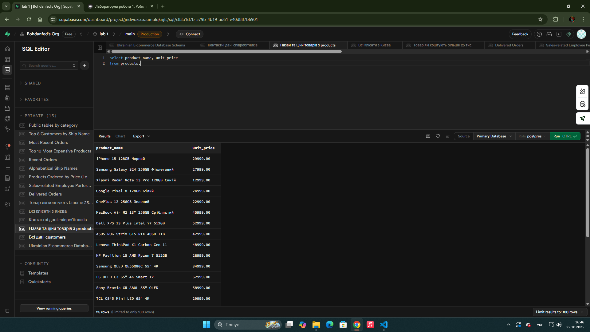

### Показати контактні дані всіх співробітників (ім'я, прізвище, телефон, email).
```sql
select last_name, first_name, phone, email
from employees;
```

Результат: Отримано 8 контактних даних співробітників. Їхнє ім'я, прізвище, телефон та email.

Скріншот
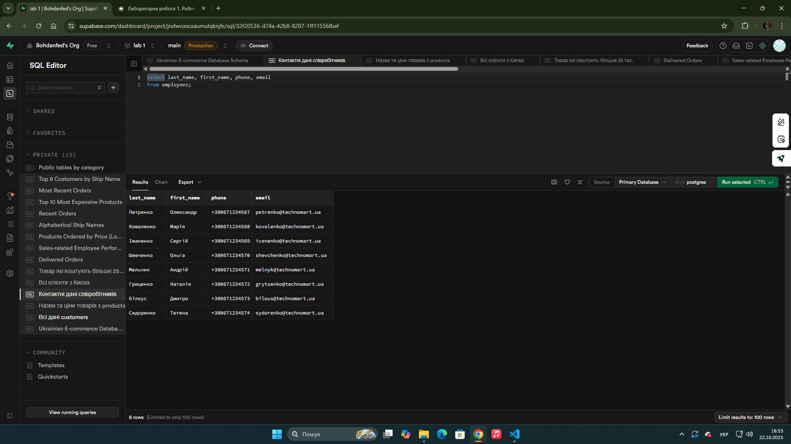
### Знайти всіх клієнтів з міста Київ.
```sql
select ship_name, ship_city
from orders
where ship_city = 'Київ';
```

Результат: Отримано 9 клієнтів, які знаходятся в місті київ

Скріншот
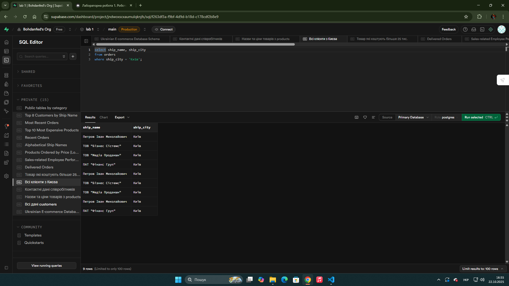
### Вивести товари, які коштують більше 25000 грн.
```sql
select product_name, unit_price
from products
where unit_price > 25000;
```

Результат: Отримано 13 назв товарів, ціна яких перевищує 25000 грн.

Скріншот
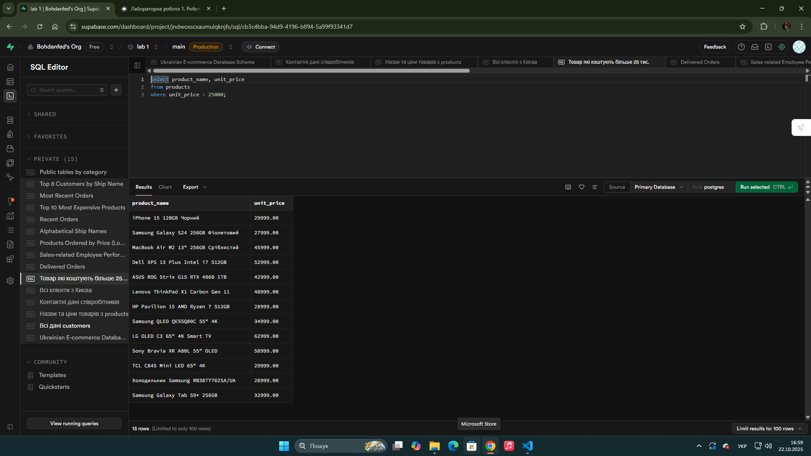
### Показати всі замовлення зі статусом 'delivered'.
```sql
select *
from orders
where order_status = 'delivered';
```

Результат: Отримано 26 записів замовлень, які вже доставлені. Включаючи айді замовленння і замовника; дату замовлення, дату в яку замовлення має прибути та дату коли замовлення брибуло; назва пошти; вартість доставки; ім'я замовника; адреса замовника; місто; айді міста; індефікаційни код міста. 

Скріншот
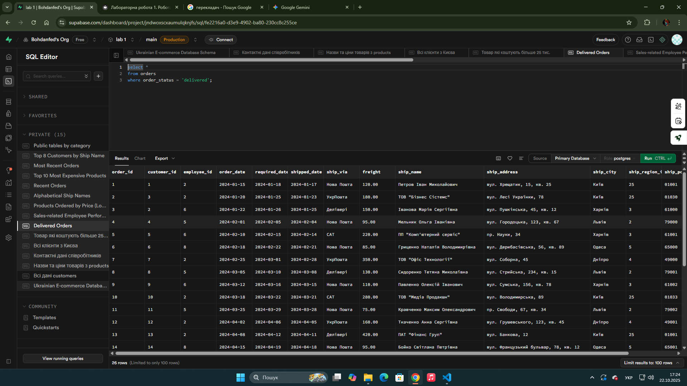
### Знайти співробітників, які працюють у відділі продажів (посада містить слово "продаж").
```sql
select * from employee_performance
where title ilike '%продаж%';
```

Результат: Отримано інформацію про співробітників в посяді яких є слово продажд. А саме про трьох осіб в записав яких виведено їхнє айді, ПІБ, посаду, дату народження, дату прийняття на роботу, адресу, місто, айді регону, індефікаційний код міста, номер телефону, емайл, зарплату та кількість людей, яким підпорядковується дана особа.  

Скріншот
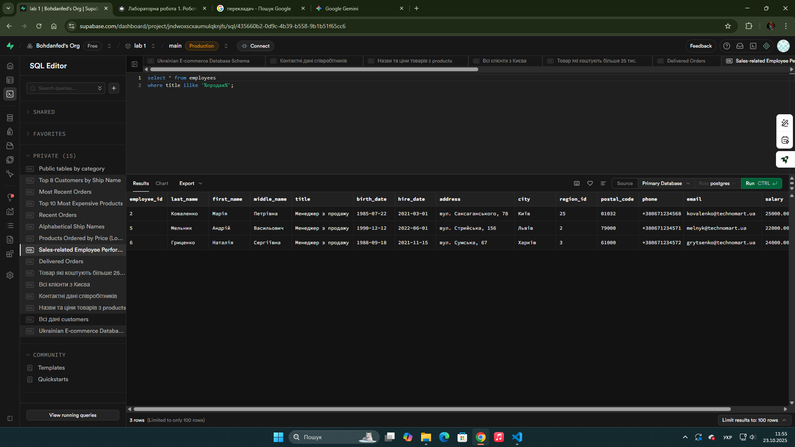
### Відсортувати товари за зростанням ціни.
```sql
select product_name, unit_price
from products
order by unit_price asc;
```

Результат: Отримано 25 товарів, їхню назву та вартість відсортовану від найдешевшого товару до найдорожчого.
Скріншот
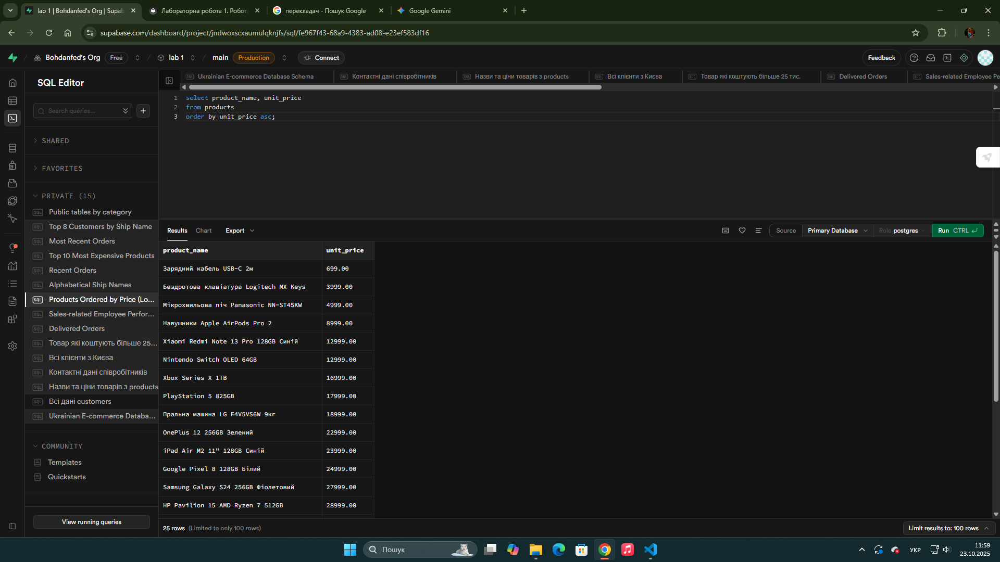
### Показати клієнтів в алфавітному порядку за іменем контактної особи.
```sql
select ship_name
from orders
order by ship_name asc;
```

Результат: Отримано 31 запис клієнтів в алфавітному порядку, ПІБ фізичних осіб та назву компанії юридичних осіб.
Скріншот
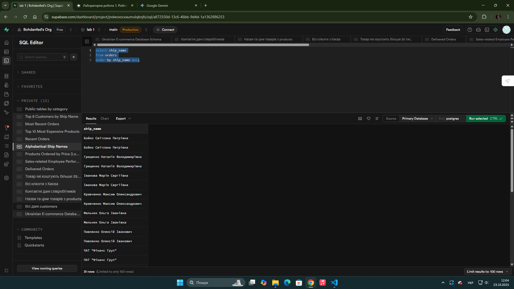
### Вивести замовлення від найновіших до найстаріших.
```sql
select order_id, order_date, customer_id
from orders
order by order_date desc;
```

Результат: Отримано 31 замовлення, які відсортовані за датою від найновіших до найстаріших. Вивелено айді замолення, дату завлення та айді замовника
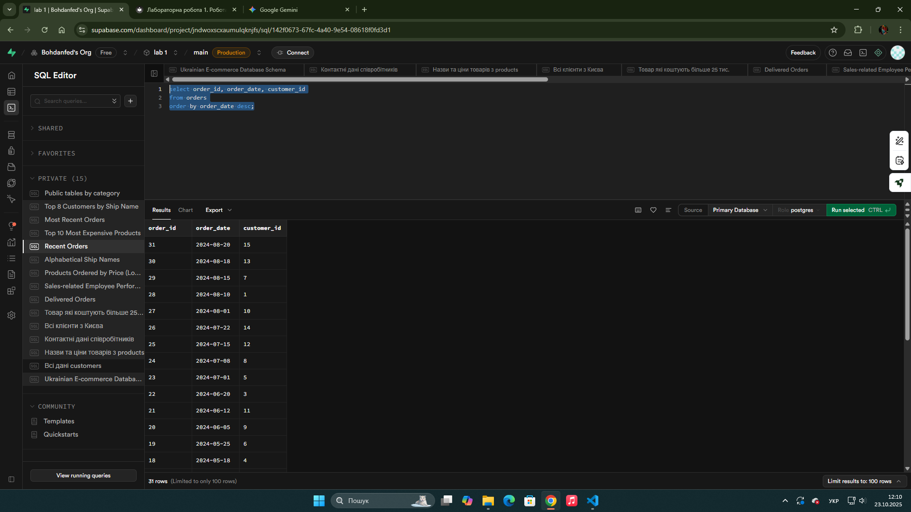
### Показати перші 10 найдорожчих товарів.
```sql
select product_name, unit_price
from products
order by unit_price desc
limit 10;
```

Результат: Отримано перших 10 найдорожчіх товарів, їхню назву та ціну.
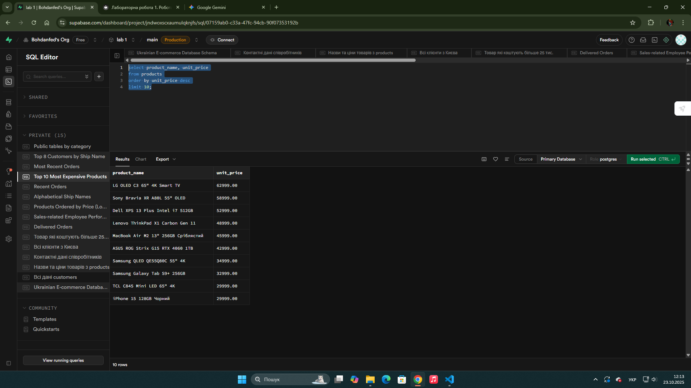
### Вивести 5 останніх замовлень (за датою).
```sql
select order_id, order_date, customer_id
from orders
order by order_date desc
limit 5;
```

Результат: Отримано 5 останіх замовлення, їхню дату, айді замолення та замовника.
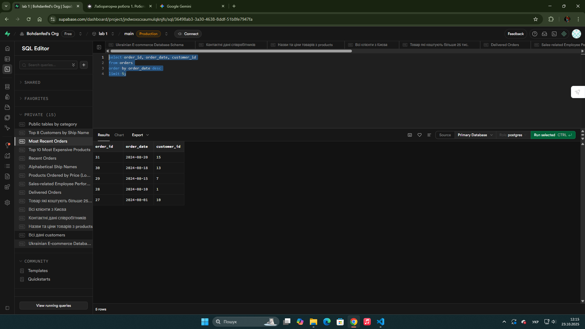
### Отримати перших 8 клієнтів в алфавітному порядку.
```sql
select customer_id, ship_name
from orders
order by ship_name asc
limit 8;
```

Результат: Отримано 8 клієнтів які є першими за зписком в алфавітному порядку, а також їхнє айді.
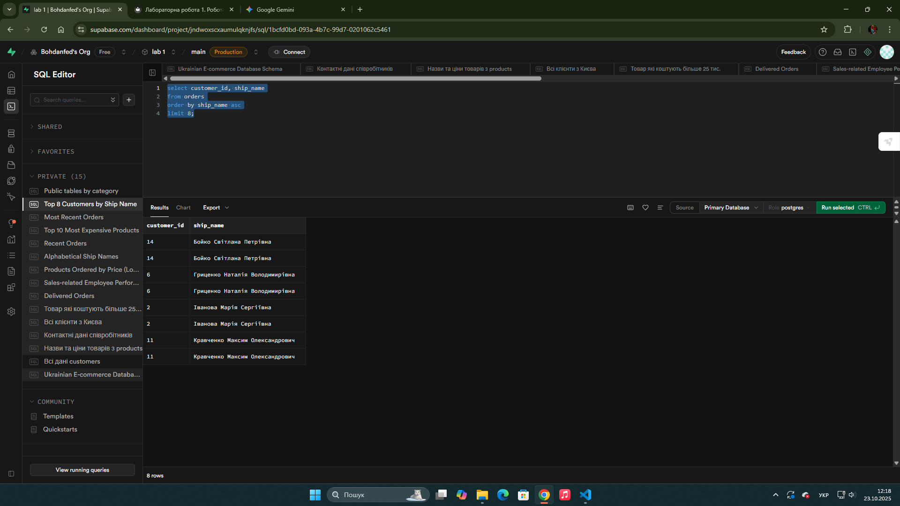
Скріншот

## Висновки. Я навчивсся основам роботи із реляційними базами даних, дослідив їхню структуру, та навчився робити базові запити для отримання потрібної мені інформації.

**Самооцінка**: 3

**Обгрунтування**: Тому що я вибрав перший рівень скланості.
